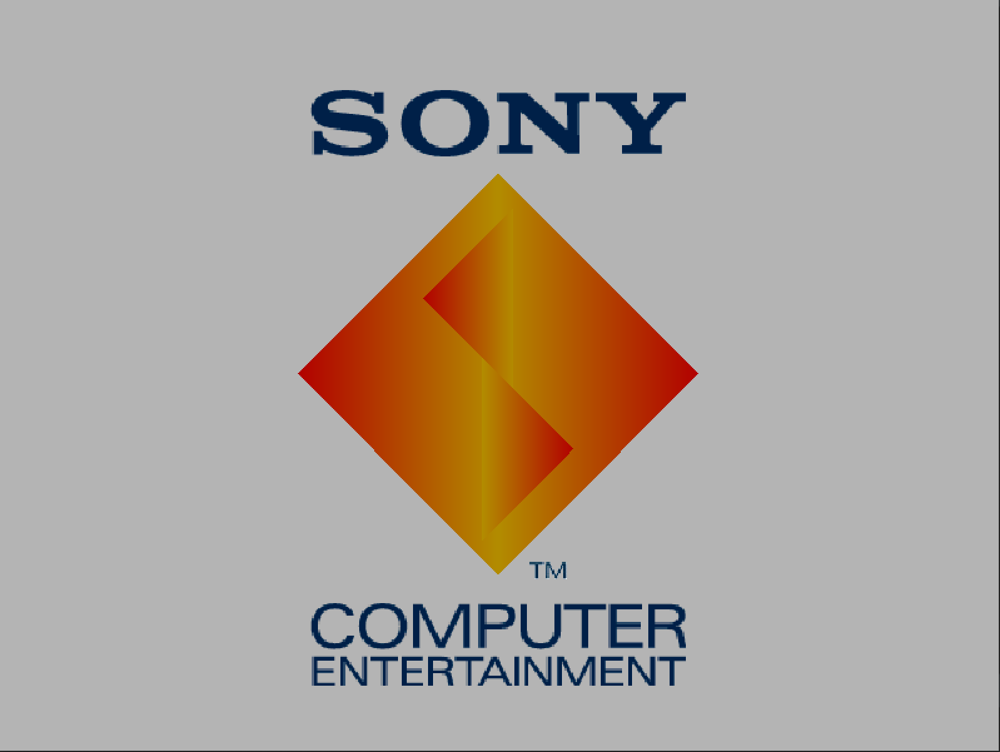
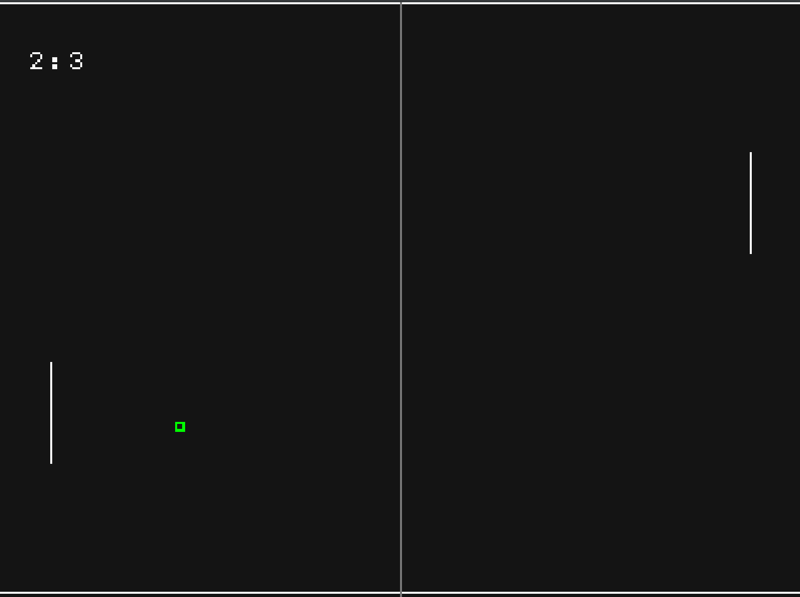

## 7Pong for PSX

#### Introduction & rules:

> 7Pong is a simple Pong clone, which is played according to the same rules as the original and is designed for two human players. The first player to score 11 or more points, with a lead of at least 2 points, wins the game.
> To run the game, all you need is a working PSX emulator or a modded original console.

#### Controls:

> - up -> paddle moves up
>- down -> paddle moves down
>- start -> the ball flies off in random direction
>- select -> the ball is reset to its start position

#### Prerequisites:
- 32-bit Windows OS

#### Setup & useful links:
- Install Sony SDK PSY-Q: http://www.psxdev.net/help/psyq_install.html

- Set Environment Variables: http://www.psxdev.net/forum/viewtopic.php?f=49&t=206

- How to build bootable PSX images: http://www.psxdev.net/help/psyq_hello_world.html

- simple Tutorial for hello world: http://www.psxdev.net/help/psyq_hello_world.html

- Wituz's Video Tutorial Series: https://www.wituz.com/make-playstation-1-games.html

- PSXDEV Network (homebrew community): http://www.psxdev.net/forum/index.php

#### Screenshots

> ### Boot Logo
> 

> ### Gameplay
> 

#### Credits to

- Wituz: https://www.wituz.com
- PSXDEV Network: http://www.psxdev.net